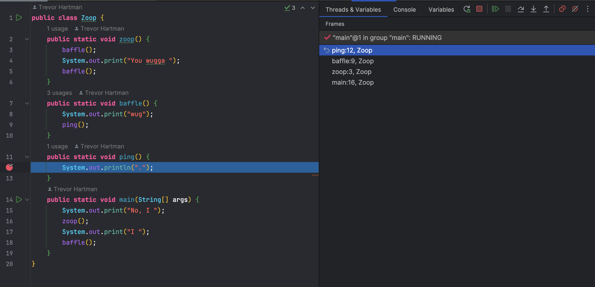

# Java Lab 004

**Instructions:**
1. Fork this repository to your GitHub account.
2. Clone the forked repository locally to your machine.
3. Create a new branch named Feature01.

## Part 1: Redesigning Code as Methods

**Objective:**
Redesign code from a previous exercise into methods that take parameters.

**Instructions:**
1. Create a new Java file named **RedesignDate.java**
2. Write a method called `printAmerican` that takes the day, date, month, and year as parameters and displays them in American format.
3. Test your method by invoking it from `main` and passing appropriate arguments. The output should look something like this (except the date might be different): "Monday, July 22, 2019".
4. Once you have debugged `printAmerican`, write another method called `printEuropean` that displays the date in European format.

---

## Part 2: Execution Flow and Method Calls

**Objective:**
Review the flow of execution through the program [Zippo.java](src/Zippo.java), a program with multiple methods.

**Questions to Answer In This README.md:**
1. Write the number 1 next to the first line of code in this program that will execute.
2. Write the number 2 next to the second line of code, and so on until the end of the program.
3. What is the value of the parameter `blimp` when `baffle` gets invoked?
   >rattle
4. What is the output of this program?
   >ik <br>
   rattle <br>
   ping zoop <br>
   boo-wa-ha-ha <br>

---

## Part 3: Stack Diagram and Program Output

**Objective:**
Answer questions about stack diagrams and program output without running the program in [Zoop.java](src/Zoop.java).

**Questions:**
1. Draw a stack diagram that shows the state of the program the first time `ping` is invoked.
    * Hint: If you Google how to use IntelliJ's **BreakPoint** functionality, you can screenshot the **program state** instead of drawing it.
      * Regardless of your methodology, a picture of the programs state should be added to this Repo and committed.
            
2. What is the output by the following program?
    * Paste your output in the bash code-block below.
```bash
No, I wug.
You wugga wug
I wug.
```

---

## Part 4: Exploring Method Invocations

**Objective:**
Explore method invocations and their consequences.

**Questions to answer in the README.md via Markdown:**
1. What happens if you invoke a value method and don’t do anything with the result; that is, if you don’t assign it to a variable or use it as part of a larger expression?
   >The method is executed but the returned value is lost. 
2. What happens if you use a void method as part of an expression? For example, try `System.out.println("boo!") + 7;`.
   > You get a compile error that says "not a statement" and IntelliJ says "Operator '+' cannot be applied to 'void'."
---

## Part 5: Stack Diagram and Program Output

**Objective:**
Draw a stack diagram that shows the state of the program the second time `zoop` is invoked in file [Part5.java](src/Part5.java). Determine the complete output.

**Questions:**
1. Draw a stack diagram that shows the state of the program the second time `zoop` is invoked.
    * Hint: If you Google how to use IntelliJ's **BreakPoint** functionality, you can screenshot the **program state** instead of drawing it.
    * Regardless of your methodology, a picture of the programs state should be added to this Repo and committed.
   
2. What is the complete output?
    * Paste your output in the bash code-block below.
```bash
just for
any not more 
It's breakfast 
!
```

## Submission
Follow these steps for submission:
1. Create a Feature01 branch of your code if you haven't already.
2. Draw the stack diagram and determine the complete output.
3. Commit your answers to your local copy/Feature01 branch.
4. Push it to your Remote/origin branch (i.e., GitHub: Feature01 -> origin/Feature01).
5. Issue a Pull request to my instructor repo.
6. **Make sure to COPY the Pull request URL and submit it for the lab/assignment in Canvas.**